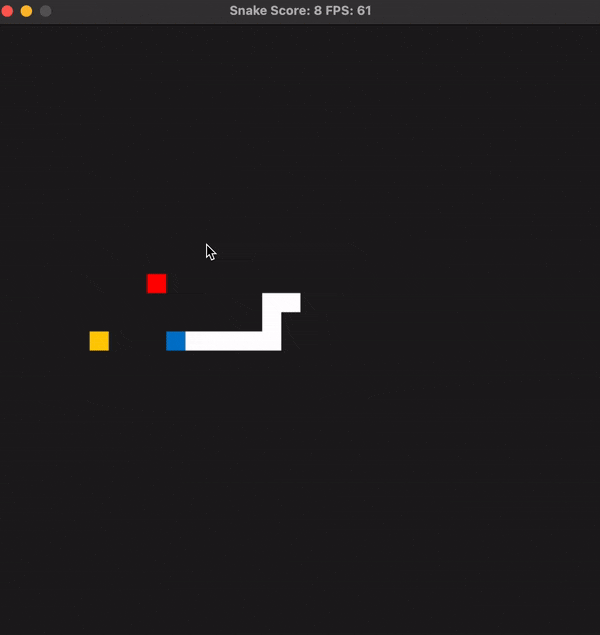

# CPPND: Capstone Snake Game -- Student Submission

This is a user submission for the Capstone project in the [Udacity C++ Nanodegree Program](https://www.udacity.com/course/c-plus-plus-nanodegree--nd213)

## Overview
This version of the snake game includes a second "CPU" player best described as a "hunter". The `Hunter`'s goal is simple: beat the snake to the food. The `Snake`'s goal is the same--eat the food and avoid "eating" itself--while additionally, avoiding the `Hunter`. Luckily for the `Snake`, the `Hunter` is unable to travel "downwards", i.e., in the positive y-direction. Perhaps the `Hunter` always travels away from the sun to avoid the blinding light? 

Specifically, *this* Snake game adds the following:
- A `Hunter` object--that the `Snake` must avoid--that inefficiently tracks down and eats food
- A `scores.txt` file that allows the user to append their score
- Concurrent reading back of the high score in the `scores.txt` file to the user



## Rubric 
The following is not an exhaustive explanation of all the minor, yet important, adds to the code that facilitates the added implementations aforementioned, but covers specifically how the project meets the criteria listed in the rubric.

### Loops, Functions, I/O
- [x] The project demonstrates an understanding of C++ functions and control structures
- [x] The project reads data from a file and process the data, or the program writes data to a file
- [x] The project accepts user input and processes the input

The methods `Game::Writescores()` and `Game::ReadHighScore()` meet the requirements above as can be seen below:
```C++
void Game::WriteScores() {
  // Once game terminates, uses enters name which is appended to the scores file with score
  std::string name;

  while (name.empty()) {
    std::cout << "Please enter an alphanumeric name: ";
    std::cin >> name;
  }

  // locking access to score .txt file
  std::lock_guard<std::mutex> lck(_mutex);

  // writing name and score to file
  std::ofstream myfile;
  myfile.open(filePath, std::ios::app);
  myfile << name << " " << score << std::endl;
  myfile.close();
}

int Game::ReadHighScore() {
  // locking access to score .txt file
  std::lock_guard<std::mutex> lck(_mutex);

  int high_score{0};
  std::string person, score;
  std::string line;
  std::ifstream filestream(filePath);
  if (filestream.is_open()) {
    while (std::getline(filestream, line)) {
      std::istringstream linestream(line);
      linestream >> person >> score;
      if (std::stoi(score) >= high_score) {
        high_score = std::stoi(score);
      }
    }
  }
  std::cout << "Current High Score is " << high_score << std::endl;
  return high_score;
}
```
### Object Oriented Programming 
- [x] One or more classes are added to the project with appropriate access specifiers for class members
- [x] Class constructors utilize member initialization lists
- [x] Classes follow an appropriate inheritance hierarchy with virtual and override functions

The `Hunters` class was added as a base class from which the newly added `Hunter` class and the `Snake` class inherit members. As will be seen below, the `Snake` class builds from the base class; and both classes utilize the base class constructor

```C++
class Hunters {
public:
    enum class Direction { kUp, kDown, kLeft, kRight };

    // Hunters class is constructed using offset as a scaled offset from the x-y origin
    Hunters(int grid_width, int grid_height, int offset)
        : grid_width(grid_width),
          grid_height(grid_height),
          head_x(grid_width /offset),
          head_y(grid_height /offset) {}

    virtual void Update();
    virtual bool HunterCell(int x, int y);

    Direction direction = Direction::kUp;

    bool alive{true};
    float speed{0.1f};
    float head_x;
    float head_y;

protected:
    virtual void UpdateHead();

    int grid_width;
    int grid_height;
};

class Hunter : public Hunters {
public:
    Hunter(int grid_width, int grid_height, int offset) : Hunters(grid_width, grid_height, offset) {}

    float speed{0.1f};
    int distance_x;
    int distance_y;

};
```

```C++
class Snake : public Hunters {
public:

 // Copied constructor of base class
 using Hunters::Hunters;

  // Destructor added
  ~Snake() { std::cout << "Snake object destroyed"; }

  void Update () override;

  void GrowBody();
  bool HunterCell(int x, int y) override;

  Direction direction = Direction::kUp;

  int size{1};
  std::vector<SDL_Point> body;

 private:
  void UpdateHead() override;
  void UpdateBody(SDL_Point &current_cell, SDL_Point &prev_cell);

  bool growing{false};
};
```
### Memory Management
- [x] The project makes use of references in function declarations
- [x] The project uses destructors appropriately
- [x] The project uses scope / Resource Acquisition Is Initialization (RAII) where appropriate
- [x] The project uses smart pointers instead of raw pointers

Per the first point, added methods `Controller::Track` and `Controller::Hunt` both make use of references in function declarations, i.e.,
```C++
class Controller {
 public:

  void HandleInput(bool &running, Snake *snake) const;

 // Added method
  void Track(bool &running, Hunter &hunter, SDL_Point &food) const;


 private:
 // Added method
  void Hunt(Hunter &hunter) const;
  // ...
```
Additionally, the `Snake` object was converted to a dynamically-allocated object by making it a `shared_pointer`. The `Game::Game` constructor was modified to make that possible, and the source code was modified to access object pointer methods. Note that the raw pointer is used throughout the source code--accessed using the `.get()` method--as the underlying object is our exclusive concern
```C++
Game::Game(std::size_t grid_width, std::size_t grid_height)
    : engine(dev()),
      random_w(0, static_cast<int>(grid_width - 1)),
      random_h(0, static_cast<int>(grid_height - 1)),
      hunter(grid_width, grid_height, 4) { // Hunter competes with the snake for the food while also acting as a predator for the player
  // Initialize snared pointer to snake object, with an offset of half the grid_width and height (center)
  snake = std::make_shared<Snake>(grid_width, grid_height, 2);
  PlaceFood();
}
```
Examples of source code changes:
```C++
void Controller::ChangeDirection(Snake *snake, Snake::Direction input,
                                 Snake::Direction opposite) const {
  if (snake->direction != opposite || snake->size == 1) {
    snake->direction = input;
  }
  return;
}
```

### Concurrency
- [x] The project uses multithreading
- [x] A promise and future is used in the project
- [x] A mutex or lock is used in the project

The method `Game::ReadHighScore` is launched as a concurrent task as follows:
```C++
void Game::Run(Controller const &controller, Renderer &renderer,
               std::size_t target_frame_duration) {
  Uint32 title_timestamp = SDL_GetTicks();
  Uint32 frame_start;
  Uint32 frame_end;
  Uint32 frame_duration;
  int frame_count = 0;
  bool running = true;

  // Task is launched to read high score from text file while user is playing
  std::future<int> future = std::async(&Game::ReadHighScore, this);
  highScore = future.get();
  // ...
```
A mutex is locked within both, the `Game::ReadHighScore` and `Game::WriteScores` in order to avoid concurrent reading/writing of the same resource, which is shown in the following excerpt:
```C++
void Game::WriteScores() {
  // Once game terminates, uses enters name which is appended to the scores file with score
  std::string name;

  while (name.empty()) {
    std::cout << "Please enter an alphanumeric name: ";
    std::cin >> name;
  }

  // locking access to score .txt file
  std::lock_guard<std::mutex> lck(_mutex);
  // ...
```


## Dependencies for Running Locally
* cmake >= 3.7
  * All OSes: [click here for installation instructions](https://cmake.org/install/)
* make >= 4.1 (Linux, Mac), 3.81 (Windows)
  * Linux: make is installed by default on most Linux distros
  * Mac: [install Xcode command line tools to get make](https://developer.apple.com/xcode/features/)
  * Windows: [Click here for installation instructions](http://gnuwin32.sourceforge.net/packages/make.htm)
* SDL2 >= 2.0
  * All installation instructions can be found [here](https://wiki.libsdl.org/Installation)
  >Note that for Linux, an `apt` or `apt-get` installation is preferred to building from source. 
  
  >*For MacOS*, I found that using a homebrew install works best, as found in the top reply to this stack overflow post: https://stackoverflow.com/questions/47295218/install-sdl2-in-mac, i.e.,
  ```
  brew install SDL2
  brew install SDL2_image
  brew install SDL2_ttf
  ```

* gcc/g++ >= 5.4
  * Linux: gcc / g++ is installed by default on most Linux distros
  * Mac: same deal as make - [install Xcode command line tools](https://developer.apple.com/xcode/features/)
  * Windows: recommend using [MinGW](http://www.mingw.org/)

## Basic Build Instructions

1. Clone this repo.
2. Make a build directory in the top level directory: `mkdir build && cd build`
3. Compile: `cmake .. && make`
4. Run it: `./SnakeGame`.


## CC Attribution-ShareAlike 4.0 International


Shield: [![CC BY-SA 4.0][cc-by-sa-shield]][cc-by-sa]

This work is licensed under a
[Creative Commons Attribution-ShareAlike 4.0 International License][cc-by-sa].

[![CC BY-SA 4.0][cc-by-sa-image]][cc-by-sa]

[cc-by-sa]: http://creativecommons.org/licenses/by-sa/4.0/
[cc-by-sa-image]: https://licensebuttons.net/l/by-sa/4.0/88x31.png
[cc-by-sa-shield]: https://img.shields.io/badge/License-CC%20BY--SA%204.0-lightgrey.svg
